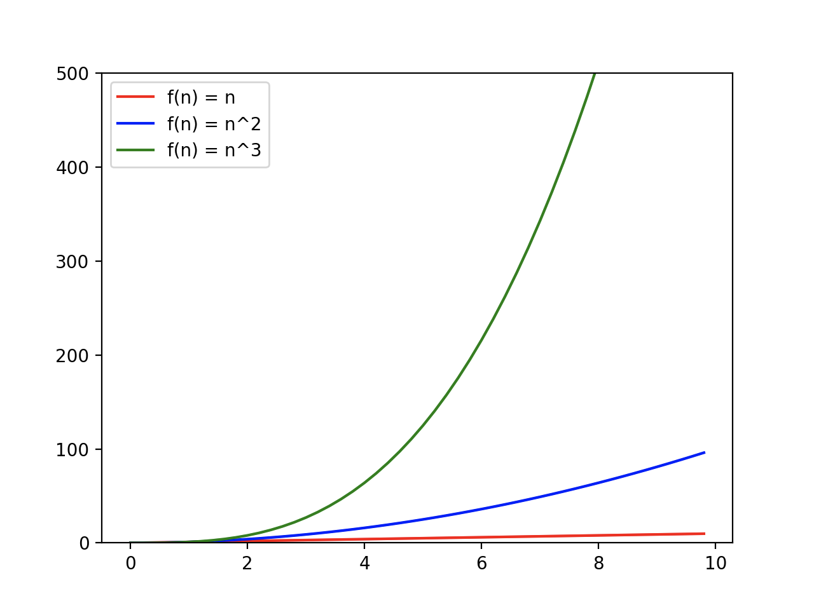
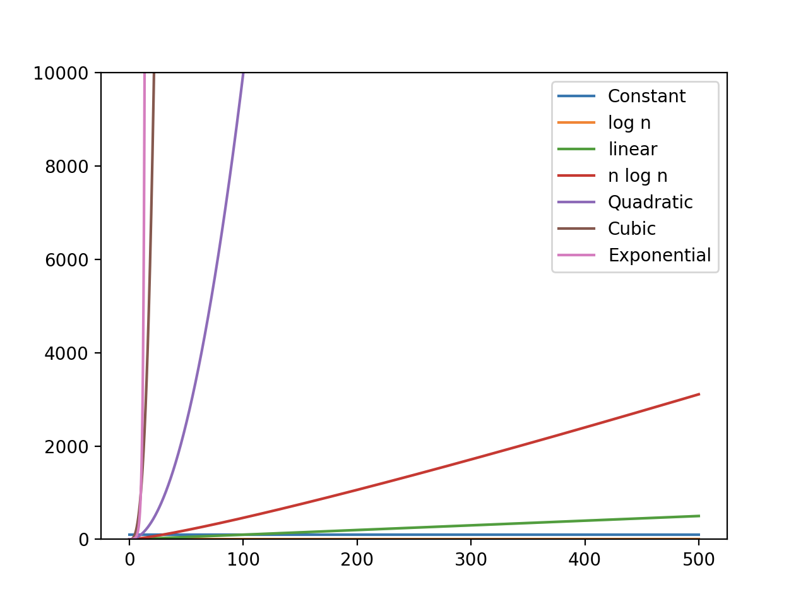
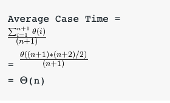
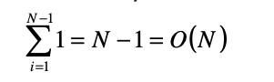
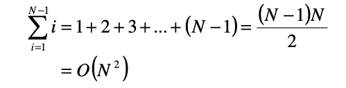
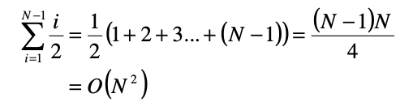

## Asymptotic Analysis

Khi cùng đưa vào 2 thuật toán đề giải quyết một task, bằng cách nào ta có thể cái nào là tốt hơn?
Theo một cách ngây thơ nhất, ta có thể triển khai và thực thi cả hai với các input khác nhau và xem thử xem thuật toán nào chiếm ít thời gian hơn.
Nhưng có nhiều vấn đề với hướng tiếp cận này, có thể kể đến như:

- Với một vài input cụ thể, thuật toán thứ nhất có thể nhanh hơn. Nhưng đối với những input khác, thuật toán thứ hai lại nhanh hơn đáng kể.
- Với một vài input, thuật toán thứ nhất có thể chạy nhanh hơn ở thiết bị này, nhưng khi thay đổi thiết bị thuật toán thứ hai lại thực thi nhanh hơn.

Lúc này `Asymptotic Analysis` xuất hiện như một ý tưởng để giải quyết những vấn đề bên trên trong việc phân tích thuật toán.
Trong `Asymptotic Analysis`, chúng ta đánh giá một cách phỏng đoán hiệu suất của một thuật toán dựa vào theo sự quan hệ với kích thước input (Chúng ta không đo lường thời gian chạy thực tế của thuật toán).
Chúng ta tính toán cách thức thời gian thực thi (hoặc không gian vùng nhớ) mà thuật toán chiếm lấy khi chúng ta tăng kích thước input (dữ liệu đầu vào).

Ví dụ, khi chúng ta phân tích thời gian thực thi của 2 thuật toán sắp xếp là `insertion sort` và `merge sort`.
`Insertion sort` sẽ cần một thời gian là `T(n)` được thể hiện thông qua phương trình `T(n) = c*n^2 + k`.
`Merge sort` sẽ cần một thời gian `T'(n)` và cũng được thể hiện qua phương trình `T'(n) = c'*n*log2(n) + k'`.
Thông thường khi áp dụng Asymptotic Analysis người ta thường hướng đến việc ước tính sự chậm chạp của một thuật toán khi nó phải nhận một input lớn,
cho nên những giá trị nhỏ của biến số `n` thường được bỏ qua.
Với cách tính toán này, một thuật toán được thể hiện với phương trình bậc một (`f(n) = c*n + k`) sẽ nhanh hơn thuật toán được thể hiện dưới dạng một phương trình bậc 2 (`f(n) = c*n^2 + k`).

Vì vậy, ta có thể khẳng đinh rằng, khi input lớn, thì `merge sort` sẽ chạy với thời gian là `n*log2(n)` (bỏ qua 2 hằng số c' và k')
và nó nhanh hơn `insertion sort` - có thời gian chạy là `n^2` (bỏ qua 2 hằng số là c và k).

_Note_: Ta có thể dễ dàng chứng minh như sau:

```
     n log(n)
lim --------- = 0;
       n^2

      n log(n)          log(n)            1/n           1
lim ------------- = lim --------  =  lim ------- = lim ---- = 0
       n^2                 n               1            n
```

Điều này có nghĩa là `n^2` sẽ mức độ tăng lớn hơn `n*log2(n)`, hay nói cách khác, khi n hướng tới vô cùng, `merge sort` sẽ có thời gian chạy ít hơn `insertion sort`.

Asymptotic Analysis không phải lúc nào cũng là một giải pháp hoàn hảo.
Vì nó tập trung vào input có kich thước lớn, nhưng trong thực tế có thể phần mềm của chúng ta sẽ không được cung cấp một lượng input lớn đến như vậy,
cho nên sẽ có vài trường trường hợp, một thuật toán có `Asymptotic Analysis` không tốt nhưng lại là giải pháp tốt nhất cho phần mềm của bạn.

Ví dụ như ta có hai thuật toán được biểu thị bởi 2 phương trình lần lượt là `f(n) = 0.2*n` và `f'(n) = 1000*log(n)`,
theo như quy tắc tính của Asymptotic Analysis, thì rõ ràng thuật toán thứ 2 (f'(n)) sẽ nhanh hơn thuật toán thứ nhất.
Nhưng đó chỉ đúng khi input đạt đến một độ lớn nhất định, còn đối với khoảng input nhỏ hơn, thuật toán đầu tiên mới là lựa chọn tốt nhất cho phần mềm của chúng ta.

## Growth of Functions

Ở phần trên, ta đã nó đến sự tương quan giữa thời gian thực thi của một thuật toán với kích thước (độ lớn) của input (`size(n)`).
Chúng ta cũng đã xem xét, so sánh 2 thuận toán thông qua 2 phương trình tương ứng với từng thuật toán.
Phần này ta sẽ làm rõ hơn đồng thời thêm vài ví dụ minh hoạ về `Growth of Functions` thể hiện thời gian thực thi của thuật toán.

Giả sử chúng ta lần lượt có 3 phương trình đại diện cho 3 thuận toán lần lượt như sau:

```
f(n) = n;
f(n) = n^2;
f(n) = n ^3;
```

Cách tiếp cận dễ nhất để xem xét thuật toán nào chạy nhanh hơn (ít thời gian hơn) là chúng ta sẽ thể hiện 3 phương trình trên lên toạ độ Oxy,để thấy được sự tương quan giữa n và t (thời gian).



Nhìn vào biểu đồ, ta dễ dàng nhận thấy rằng function `n^3` sẽ tăng vượt trội hơn `n^2` và `n`.
Vì vậy, thời gian thực thi của thuật toán thứ nhất (`n`) sẽ nhanh hơn thuật toán thứ 2 (`n^2`) và 3 (`n^3`).

Ngoài việc thể hiện một cách trực quan trên biểu đồ, ta có thể thông qua làm phép tính để biết được phương trình nào sẽ có mức tăng vượt trội hơn,
tương tự những gì ta đã làm ở cuối phần trước, chúng ta sẽ tính chia 2 phương trình cho nhau và tính giới hạn `lim(n -> ∞)` của chúng:

```
               f(n)
       lim =  ------
      n -> ∞   g(n)
```

Nếu giới hạn hướng là 0, f(n) sẽ tăng vượt trội hơn g(n). Ngược lại, nếu giới hạn hướng về ∞, g(n) sẽ tăng vượt trội hơn f(n).

Dưới đây là bảng sắp xếp theo thứ tự thời gian thực thi tăng dần thường gặp trong phân tích thuật toán:

| Running Time | Examples                 |
| ------------ | ------------------------ |
| Constant     | 1, 2, 100, 300, …        |
| Logarithmic  | logn, 5logn, …           |
| Linear       | n, n+3, 2n+3, …          |
| nlogn        | nlogn, 2nlogn+n, …       |
| Polynomial   | n^2, n^3 or higher order |
| Exponential  | 2^n, 3^n, 2^n + n^4, …   |
| Factorial    | n!, n! + n, …            |

Hoặc trực quan hoá theo biểu đồ dưới đây:



## Worst, Average and Best Cases

Theo như các section trước, mọi người đều đã biết thời gian thực thi của một thuật toán sẽ tăng lên khi input size (n) tăng.
Nhưng, đôi khi, với cùng input size, thời gian thực thi của thuật toán cũng sẽ khác nhau nếu nhận vào các biến thể khác nhau của input đó.
Trong trường hợp này, ta sẽ tiến hành phân tích `Best case`, `Worse case` và `Average case`. `Best case ` sẽ cho thời gian thực thi ngắn nhất, `Worse case` sẽ cho thời gian thực thi dài nhất, và `Average case` sẽ cho thời gian trung bình cần thiết để thực thi thuật toán.

Để lấy ví dụ, chúng ta hãy cùng xem xét thuật toán Linear Search (Tìm kiếm tuyết tính), được implement tương đối như sau:

```c
int search(int a[], int n, int item) {
    int i;
    for (i = 0; i < n; i++) {
        if (a[i] == item) {
            return a[i]
        }
    }
    return -1
}
```

Nói một cách khái quát, là chúng ta sẽ tìm kiếm và trả về vị trí của một item (`item`) bên trong một mảng cho trước (`a`) có kích thước (`size`) là `n`, nếu không tìm thấy thì sẽ return `-1`.

Nếu item chúng ta cần tìm luôn luôn nằm vị trí đầu tiên của mảng, thì độ phức tạp trong trường hợp này sẽ là `O(1)`, và đây được gọi là `Best case`.

Còn nếu như item chúng ta cần tìm luôn luôn nằm ở cuối mảng hoặc không hề tồn tại trong mảng, có nghĩa là chúng ta phải duyệt quá hết `n` item trong mảng, nên độ phức tạp sẽ là `O(n)`,
đây sẽ là `Worst case`.

Để tính được `Average case`, chúng ta cần lấy tất cả các trường hợp biến thể của input và tính toán thời gian thực thi của tất cả chúng, sau đó ta sẽ lấy tổng thời gian chia cho tổng
số lượng input. Vì chúng ta có luôn cả trường hợp item sẽ không tồn tại trong mảng input, cho nên số lượng input có thể xảy ra là `n + 1`. Cho nên ta sẽ tính tổng thời gian thực thi và chia cho `n + 1`:



Thường khó phân tích `Average case` của một thuật toán hơn là phân tích `Worst case`. Điều này là do thuật ngữ "trung bình" cho một vấn đề cụ thể thường không rõ ràng. Do đó, một phân tích `Average case` của một thuật toán được cho là hữu ích đòi hỏi phải có dữ liệu trước về sự phân bố của các trường hợp input đầu vào, đây là một yêu cầu không thực tế. Do đó, chúng tôi thường giả định rằng tất cả các đầu vào có kích thước nhất định đều có khả năng xảy ra như nhau và thực hiện phân tích xác suất cho `Average case`.

Thêm một ví dụ nữa với `Insertion sort` khi sắp xếp tăng dần 1 mảng các con số. Cách thức hoạt động của `Insertion sort` rất đơn giản.
Ta sẽ duyệt qua từng phần tử, mỗi lần duyệt qua ta sẽ so sánh phần tử đó với các phần tử đã sắp xếp trước đó, cho tới khi gặp phần tử đầu tiên nhỏ hơn nó và tiến hành chèn vào.


Ta có thể implement nó như sau:

```c
void insertionSort(int arr[], int n)
{
    int i, key, j;
    for (i = 1; i < n; i++) {
        key = arr[i];
        j = i - 1;
 
        while (j >= 0 && arr[j] > key) {
            arr[j + 1] = arr[j];
            j = j - 1;
        }
        arr[j + 1] = key;
    }
}
 
```

Nhìn vào ta có thể dễ dàng thấy thấy được dù bất cứ biến thể nào của `input` thì ta đều phải duyệt qua tất cả các phần tử của mảng.

Vậy `Best Case` của chúng ta sẽ có độ phức tạp là `O(n)`, điều này xảy ra khi mảng `input` đã được sắp xếp từ trước, hay nói cách khác, mỗi vòng duyệt ta không cần phải sắp xếp gì cả (xem như là 1 - hằng số).



Ngược lại, `Worst case` của chúng ta thì mỗi vòng duyệt ta (gọi `i` là index tạo vòng duyệt đó), thì ta sẽ phải duyệt thêm `i` phần tử để tìm được vị trí đúng đễ insert. Hay nói cách khác là mảng của chúng ta đang được sắp xếp ngược. Ta có được công thức tính như sau:



dựa vào đó ta xác định được độ phức tạp trong trường hợp này sẽ là `O(n^2)`.

Rõ ràng, thời gian thực hiện của thuật toán `Insertion sort` sẽ phụ thuộc vào số lần ta phải duyệt trong vòng duyệt thứ hai khi duyệt lần đầu qua các phần tử. Vậy ta có thể cho rằng, `Average Case` của chúng ta là ta phải duyệt qua thêm `i/2` lần ở mỗi vòng duyệt thứ `i`. Ta có công thức như sau.



Suy ra độ phức tạp vẫn sẽ tương tự như `Worst case`, vẫn sẽ là `O(n^2)`
